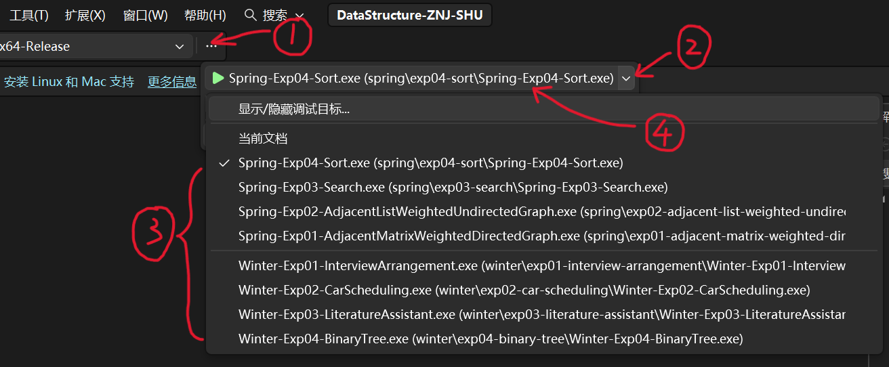

# DataStructure-ZNJ-SHU
> **2022-2023 学年上海大学计算机工程与科学学院 朱能军《数据结构》小组实验非官方仓库**

项目旨在为初学者提供一份**新手友好且现代化**的代码参考，供选修朱能军老师课程的同学学习使用。

在算法设计上，本项目参考了 Sartaj Sahni 的 *Data Structures, Algorithms, and Applications in C++*。在工程实践上，本项目尝试摒弃浓厚的 **SJ 风格**，在确保代码简单易懂的前提下，尽可能采用现代 C++ 语法特性，以追求**优雅、简洁、高效**的代码实现。

这里是我和 C++ 结缘的起点，希望通过开源为正在学习数据结构的同学们提供一些参考与启发。

## 📝 课程说明
根据 2022 学年（冬春两学期）的教学安排，每学期共包含一次个人实验和四次小组实验：
* **个人实验**：第一周当场验收，作为加分项。本项目不提供该部分代码。
* **小组实验**：由三人小组协作完成代码和报告，验收按组号顺序或倒序进行，每组负责其中一个特定实验的展示，组号可自选。

*注：据了解，部分实验内容已存在出入，请以最新的实验内容为准。*

## 🛠️ 环境配置
| 配置项 | 推荐说明 |
| :--- | :--- |
| **IDE/编辑器** | Visual Studio 2022+ (入门推荐) 或 VS Code [【官方下载】](https://visualstudio.microsoft.com/zh-hans/downloads/) |
| **构建系统** | **CMake 3.25+** |
| **语言标准** | **C++ 23** 及以上 |
| **编译器** | MSVC (Windows) 或 G++ 14+ (Linux/WSL) |

## 🚀 使用方法
1. 打开项目：进入项目根目录，右键点击 `使用 Visual Studio 打开（Open with Visual Studio）`。
2. 运行实验：每个实验均为独立的解决方案（Solution），可以在顶部启动项切换运行，操作步骤如图所示。

> **💡 运行建议**：性能测试时，请切换至 `x64-Release` 配置开启编译器优化，充分提升代码运行效率。

## 📚 实验索引
| 学期 | 实验模块 |
| :--- | :--- |
| **❄️ 冬季** | [实验一：面试安排](winter/exp01-interview-arrangement/README.md) |
|| [实验二：车厢调度](winter/exp02-car-scheduling/README.md) |
|| [实验三：文学研究助手](winter/exp03-literature-assistant/README.md) |
|| [实验四：二叉树拓展及标记二叉树](winter/exp04-binary-tree/README.md) |
| 🌱 春季 | [实验一：有向网的邻接矩阵验证及拓展](spring/exp01-adjacent-matrix-weighted-directed-graph/README.md) |
|| [实验二：无向网的邻接表验证和拓展](spring/exp02-adjacent-list-weighted-undirected-graph/README.md) |
|| [实验三：查找算法验证及设计](spring/exp03-search/README.md) |
|| [实验四：排序算法验证及设计](spring/exp04-sort/README.md) |

## 🤝 参与贡献
开源精神在于分享与共建，期待各位加入：
* 🐞 反馈问题：如果发现 Bug 或存在疑问，请随时提交 Issues 交流。
* 🛠️ 代码贡献：欢迎提交 Pull Requests，帮助同步最新的实验内容或优化现有代码实现。
* 🌟 鼓励一下：如果本项目有帮助到你，欢迎右上角点个 Star！