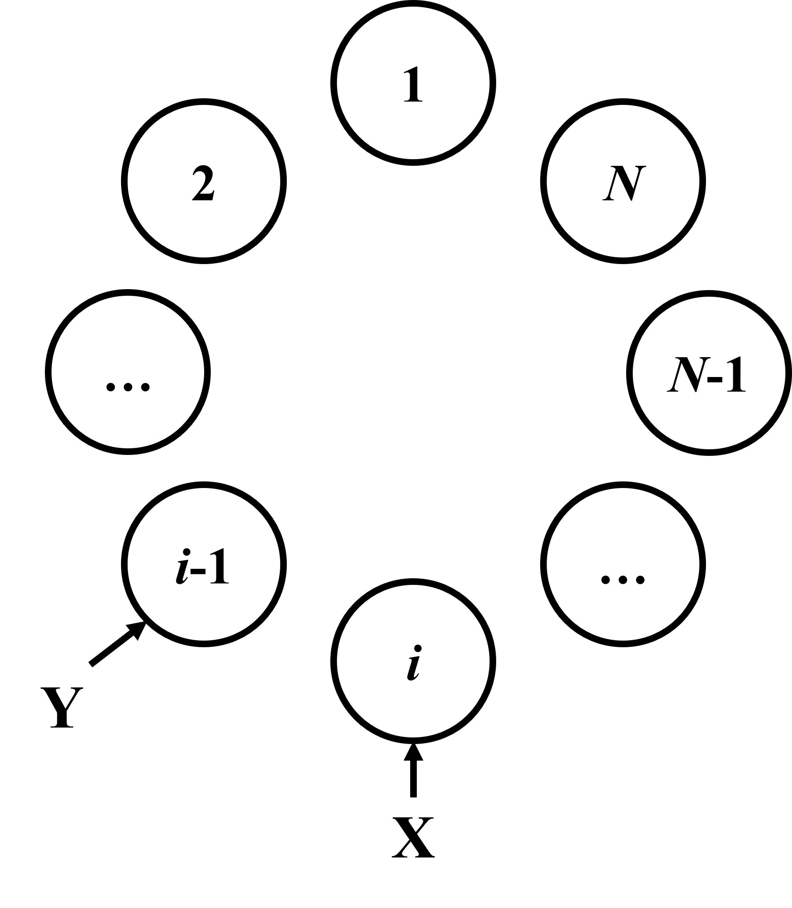

# 第二题的无限循环判断条件
记某一状态下, $X$ 和 $Y$ 表示两人所在位置, $K$ 和 $M$ 分别表示 $X$ 和 $Y$ 的步长, 取走简历前的剩余简历数为 $l$.

那么, 简历永远取不完当且仅当
$$
\begin{cases}
X = Y, \\
(K + M) \mod l = 1. \\
\end{cases}
$$

## 证明
显然如果有 $l \leq 1$ , 则总能取完简历, 因此下面所要讨论的前提是 $l>1$.

### 命题 $1$: 简历永远取不完 $\Leftrightarrow$ 存在一个状态, 从该状态起始终满足移动后 $X=Y$.
分析题目可知, 对于任一状态, 当 $X=Y$ 时, 操作前后简历数不变; 当 $X \neq Y$ 时, 简历数将减少 $1$. 所以, 如果从某状态起, 始终满足移动后 $X=Y$. 简历数将不再发生变化, 也就无法取完简历; 否则, 简历数最终必然减少至 $1$, 从而取完简历. 命题 $1$ 证毕.

**下面推导从某状态起 $X=Y$ 恒成立的条件.**

对于移动后 $X=Y$ 的情况，"取走简历"后 $Y$ 必然位于 $X$ 的顺时针相邻位置, 如下图所示.

</img>

不考虑结点编号，由于几何上具有对称性, 所以上图同时也是每个状态移动前的样子, 称这个形态为初始形态. 结合命题 $1$, 只要从初始形态开始, 使 $X$ 和 $Y$ 到达任意同一简历, 就能回到为初始形态, 使循环无限进行下去.

记 $X$ 处简历编号为 $i (1 \leq i \leq l)$, 目标简历编号为 $j (1 \leq i \leq l)$, 则可以列出条件:
$$
\begin{cases}
X = Y \\
K = u * l + j - i + 1, u \in N \\
M = v * l + i - j, v \in N \\
\end{cases}
$$

消去 $i, j$ 可得:
$$
\begin{cases}
X = Y \\
K + M = (u + v) * l + 1, u, v \in N \\
\end{cases}
$$

最后对两边取余, 消去 u 和 v, 便可得到最终最简形式:
$$
\begin{cases}
X = Y \\
(K + M) \mod l = 1 \\
\end{cases}
$$

证毕.